## Before We Begin

Show a 5 year-old a photograph of a dog and ask what color it is. She will glance at it and say "brown" without thinking twice.

Now try to explain how she did it.

Somewhere between the light hitting her eyes and the word leaving her mouth, a grid of colored dots became _a dog_. Then a string of sounds became _a question about the dog_. Then the two met, and out came an answer. She has no idea how any of this happened. For most of the history of computing, neither did we.

But things have changed quite a lot recently. Today we have SOTA models that can look, read a question about it, and not only answer but generates other visuals as prompted with impeccable detail and accuracy. We call them **Vision Language Models**.

And the first thing a Vision model needs is the ability to "_see_". A computer doesn't see a dog. It sees a few hundred thousand numbers arranged in a grid, and nothing in those numbers says "dog." So that's where a **vision Encoder** comes in the picture. Its job is to cut the image into small square patches, the way you might cut a photograph into tiles. On their own the tiles mean little. A patch of brown fur could belong to a dog, a bear, or a carpet. Meaning only emerges when the patches can _talk to each other_, when the patch with the ear can ask the patch with the snout what it's looking at. The mechanism that makes this conversation possible is called **Attention**. It is the single most important idea in modern AI, which you are going to implement on your own in the chapters ahead. Stack enough layers of attention together and you get an **Encoder**, a machine that turns pixels into understanding.

But seeing is only half the part, the model also has to "_read_", and it has to hold the image and the words in its head at the same time. Here we run into a puzzle, Images and words are completely different kinds of things. How do you put a picture _inside_ a sentence? The answer is,
A **Processor**,  a processor prepares the image and the prompt, leaving room in the text for the picture to sit. A small bridge translates what the vision encoder saw into the same language the words are written in. Once that is done, a picture is no longer a foreign object. It becomes just another part of the sentence.

Finally, the model has to "_speak_". For this we need a **Language model**, a **Decoder** that reads the combined sequence of image and words and writes its answer one word at a time. Each word it chooses is informed by everything that came before, including what it saw. We load some weights into our Vision model, write the **inference** loop, show it a picture, and ask it a question, and it answers!

#### Isn't that cool. By tinkering and arranging few lines of code in a particular order you give it the ability to See! Just like a 5 year-old who does it naturally.

---

You don't need to be an expert to make this journey. If you know that a neural network is built from layers, that a linear layer multiplies its input by a matrix and adds a bias, and that we train models by measuring a loss and nudging the weights through backpropagation, you have everything you need. Everything else is explained as we go.

Read a chapter, then close the book and open the code editor. Try to write the code _before_ you feel ready. When you get stuck, and you will, come back and reread. That moment of being stuck is not a sign that something is wrong. It is the exact moment the idea is being carved into your mind.

Don't try to memorize anything here. Memorized code is forgotten by next week. Understood code is yours forever. If you understand _why_ each piece exists and what problem would appear if you took it away, you will find something strange happens: the code starts to write itself.


---

# Chapter 1. Turning Data into Numbers

**Main Idea: A matching image and caption should give a big dot product and every mismatched pair should give a small one.**

### What's an embedding

An embedding is just a list of numbers, a vector, that stands for something. A word, a sentence, an image. If two things mean similar things, we want their vectors to point in similar directions.

The standard way to measure how similar two vectors are is the dot product. You multiply the numbers position by position and add them up:

$$\mathbf{a} \cdot \mathbf{b} = \sum_{i=1}^{n} a_i b_i$$

The dot product also equals $|\mathbf{a}|.|\mathbf{b}|\cos\theta$, where $\theta$ is the angle between the vectors. So it tells two tales: how long the vectors are and which way they point. To measure direction only, we first normalize each vector to length 1, so that $|\mathbf{a}| = |\mathbf{b}| = 1$ and the dot product becomes exactly $\cos\theta$ _(the cosine similarity)_.

If both vectors point the same way, the dot product is $1$, If they point in orthogonal directions it is close to $0$ and if they point in opposite directions it is $-1$.

*(CLIP always normalizes its vectors this way, don't worry we will learn more about CLIP ahead in the chapter).*


### A Pile of Pictures



Imagine you have a huge pile of pictures, and each picture comes with a short description. A photo of a dog with the caption "a brown dog on the grass". A photo of a pizza with "a pepperoni pizza".

You build two encoders. An image encoder turns a picture into a vector. A text encoder turns a caption into a vector. Each encoder ends with a linear projection into a shared space of the same dimension $d$, so both vectors have the same number of entries and you can take their dot product. Both are then normalized to length 1.

Now take a batch of $N$ pictures and their $N$ captions. Encode them all. You get $N$ image vectors and $N$ text vectors. Compute the dot product of every image with every caption. You get a table $S$ with $N$ rows and $N$ columns.

Row $i$ is image $i$, column $j$ is caption $j$, and the cell at row $i$ column $j$ is how similar the model thinks image $i$ and caption $j$ are.

Picture $i$ goes with caption $i$. So the correct pairs are the cells where the row number equals the column number, $S_{ii}$. That is the diagonal of the table. Every cell off the diagonal, $S_{ij}$ with $i \neq j$, is a wrong pair. There are $N$ right pairs and $(N^2 - N)$ wrong ones.


**Contrastive learning means training both encoders so that the diagonal cells become large and every other cell becomes small. The model learns by contrasting the right pair against all the wrong ones.**


### How CLIP turns this into a loss

[CLIP](https://openai.com/index/clip/) was the first well known model trained this way, from OpenAI. To see its loss you first need to know how language models are trained, because CLIP borrows the same trick.

A language model reads "I love" and has to guess the next word. It outputs one score for every word in its vocabulary. These raw scores are called logits, and we write them as $z_1, z_2, \dots, z_V$ where $V$ is the size of the vocabulary. We want the score for "you" to be the highest.

To compare scores with a correct answer, we first turn the scores into a probability distribution with a function called softmax. For each score it computes the exponential and then divides by the sum of the exponentials of all scores

$$p_k = \text{softmax}(z)_k = \frac{e^{z_k}}{\sum_{j=1}^{V} e^{z_j}}$$

The results are all positive and add up to 1, $\sum_k p_k = 1$.

Then cross entropy loss looks at the probability given to the correct answer and punishes the model when it is low. The correct answer is given as a label $y$, which is just the index of the right class. If "pizza" is word number 7 in the vocabulary, the label is $y = 7$ and the loss is

$$\mathcal{L} = -\log p_y$$

If the model gives the right word probability close to 1, $\log 1 = 0$ and the loss is almost zero. If it gives it a tiny probability, the log is a big negative number and the loss is large.

CLIP does the same thing to its table. Take row 0. It holds the similarity of image 0 with every caption, $S_{0,0}, S_{0,1}, \dots, S_{0,N-1}$. Treat those $N$ numbers as scores over $N$ classes. The right class is caption 0, so the label is 0. For row 1 the label is 1. For row $i$ the label is $y_i = i$. So the labels for all rows are simply $0, 1, 2, \dots, N-1$, which is exactly what `np.arange(n)` produces.

CLIP does this once along the rows, which asks each image to pick its caption, and once along the columns, which asks each caption to pick its image. The final loss is the average of the two

$$\mathcal{L} = \frac{1}{2}\left(\mathcal{L}_{\text{img}} + \mathcal{L}_{\text{txt}}\right)$$


Before the loss, every cell of the table is multiplied by $e^{t}$, where $t$ is a learned number called the **temperature**. So the model actually works with $S_{ij} \cdot e^{t}$. Since cosine similarities only live between $[-1,1]$ this lets the model stretch them and control how sharp the softmax gets.




Here is the whole CLIP loss,`I_e` and `T_e` are the normalized image and text embeddings, each of shape $[N, d]$.
```python
logits = np.dot(I_e, T_e.T) * np.exp(t)     # the N x N table, stretched by the temperature
labels = np.arange(n)                       # row i should pick column i
loss_i = cross_entropy_loss(logits, labels, axis=0)
loss_t = cross_entropy_loss(logits, labels, axis=1)
loss = (loss_i + loss_t) / 2
```


### Why softmax is dangerous and how to fix it

The exponential grows very fast. $e^{100}$ is 26881171418161354484126255515800135873611118; a number with 44 digits. Computers store numbers in 16 or 32 bits, which gives a maximum value. A 16 bit float (FP16) cannot go past about $65504$, and $e^{12}$ is already bigger than that. If the exponential overflows that maximum, you get infinity and training breaks. Keeping numbers inside the range the computer can hold is its called numerical stability.

The fix is a small trick. Softmax is a fraction. If you multiply the top and the bottom of a fraction by the same number, the fraction does not change. So multiply both by $e^{-c}$ for some constant $c$. Because $e^{z_k} \cdot e^{-c} = e^{z_k - c}$, this is the same as subtracting $c$ from every score before the exponential

$$\frac{e^{z_k}}{\sum_j e^{z_j}} = \frac{e^{-c} e^{z_k}}{e^{-c}\sum_j e^{z_j}} = \frac{e^{z_k - c}}{\sum_j e^{z_j - c}}$$

The factor cancels and the output is identical.

Pick $c$ to be the largest score in the vector, $c = \max_j z_j$. Now the largest value becomes $e^{0} = 1$, and everything else is smaller than 1. Nothing can overflow. In code we write it as:

```python
import numpy as np

def naive_softmax(x):
    e = np.exp(x)
    return e / e.sum()
    
def stable_softmax(x):
    z = x - x.max()          # the largest score becomes 0
    e = np.exp(z)            # every value is now at most 1
    return e / e.sum()

x = np.array([1000.0, 999.0, 998.0])
with np.errstate(over="ignore", invalid="ignore"):
    print("naive  ", naive_softmax(x))
print("stable ", stable_softmax(x))
```

output: <br>
naive   [nan nan nan] <br>
stable  [0.66524096 0.24472847 0.09003057] <br>


### The problem with CLIP at scale

Look at what this costs. To compute softmax for one row, you must first find the maximum of the whole row, then exponentiate everything, then sum the whole row, $\sum_{j=1}^{N} e^{S_{ij}}$. So a device computing that row needs the entire row in its memory. The same goes for columns. And CLIP needs both.

This makes it hard to split the table across many GPUs, and it makes very large batch sizes painful. Large batches matter in contrastive learning because more wrong pairs give the model more to contrast against. With a batch of $N$ you get $(N^2 - N)$ wrong pairs, so doubling the batch roughly quadruples the negatives.

### The sigmoid loss

A later approach changed one thing. Instead of treating each row as a competition between $N$ captions, it treats every single cell as its own yes or no question. Is this image and this caption a match?

That is a binary classification task, and the tool for it is the sigmoid function. Sigmoid takes any number and squashes it into a value between 0 and 1.




$$\sigma(s) = \frac{1}{1 + e^{-s}}$$

A big positive $s$ gives something close to 1, a big negative $x$ gives something close to 0, and $x = 0$ gives exactly $0.5$.

Each cell gets a label $y_{ij}$ that is 1 on the diagonal and 0 everywhere else

$$y_{ij} = \begin{cases} 1, & \text{if } i = j \\ 0, & \text{if } i \ne j \end{cases}$$


We push $\sigma(S_{ij})$ toward 1 for the diagonal and toward 0 for every other cell, using the usual binary cross entropy for each cell

$$\mathcal{L}_{ij} = -\Big[y_{ij}\log \sigma(S_{ij}) + (1 - y_{ij})\log\big(1 - \sigma(S_{ij})\big) \Big]$$

and the total loss is the average over all $N^2$ cells.

The real sigmoid loss also learns a bias $b$ next to the temperature, so the model can shift all scores at once. That helps at the start of training, when almost every cell is a negative.

A batch of 4 images and 4 captions gives a table of $4^2 = 16$ cells. The 4 diagonal cells are matches with label 1. The other $16 - 4 = 12$ are non matches with label 0. In general a batch of $N$ gives $N$ positives and $(N^2 - N)$ negatives.

```python
import torch
import torch.nn.functional as F

# sigmoid loss

def sigmoid_loss(img_emb, txt_emb, t, b):
    logits = img_emb @ txt_emb.T * t.exp() + b   # [N, N]
    labels = torch.eye(logits.size(0))           # 1 on the diagonal, 0 elsewhere

    return F.binary_cross_entropy_with_logits(logits, labels)

# toy batch; every cell is yes/no
N, d = 4, 8
img = F.normalize(torch.randn(N, d), dim=-1)
txt_random = F.normalize(torch.randn(N, d), dim=-1)
txt_matching = img.clone()                     # a perfect encoder would give this
t, b = torch.tensor(2.3), torch.tensor(-3.0)

print("positives", N, "| negatives", N * N - N)
print("loss with random captions:", sigmoid_loss(img, txt_random, t, b).item())
print("loss with matching captions:", sigmoid_loss(img, txt_matching, t, b).item())
```

output: <br>
positives 4 | negatives 12 <br>
loss with random captions:   0.6071510910987854 <br>
loss with matching captions: 0.2847801446914673


The big win is independence. No cell needs to know about any other cell. Look at $\mathcal{L}_{ij}$ again, it only uses $S_{ij}$. There is no row maximum and no row sum. So you can cut the table into blocks, send each block to a different device and compute them separately. This is why the sigmoid loss scales to batches of a million pairs.


### Why use a contrastive encoder in a VLM

Our vision language model only keeps the image encoder from this training, not the text one. Why pick an encoder trained this way rather than a plain image classifier?

Because its image vectors were trained to line up with language. They already carry the kind of meaning text cares about. Also this training data is cheap. The internet is full of images with descriptions, like Wikipedia captions or the alt text of HTML images, which is the text shown when an image fails to load. Some descriptions are wrong or noisy, but with billions of examples the model still learns good representations.

---
