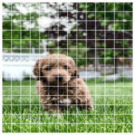
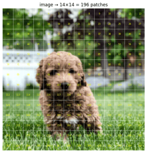
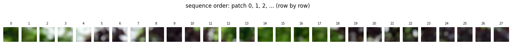
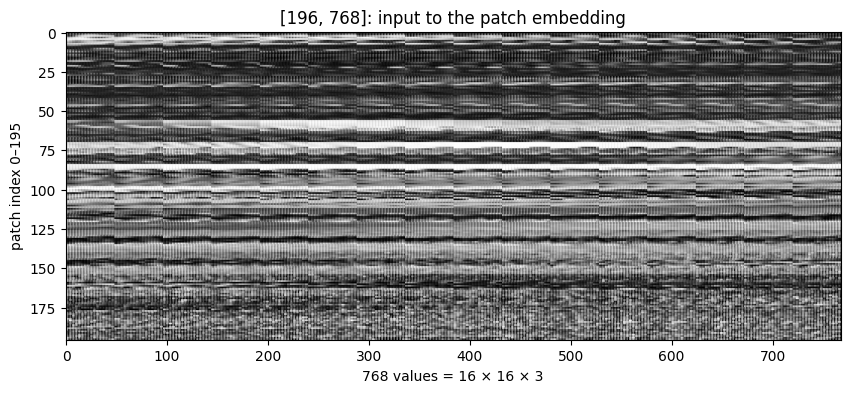
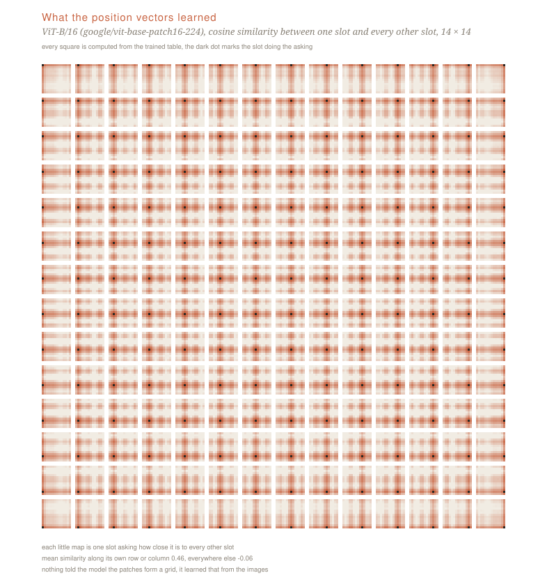
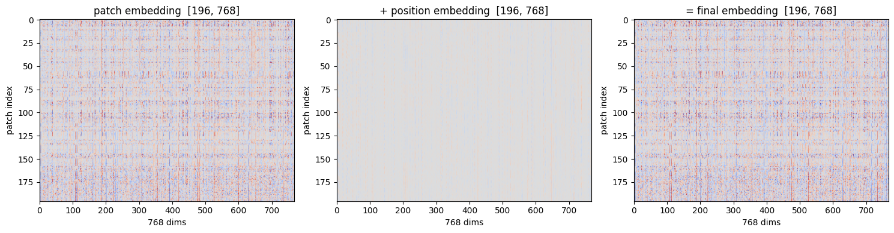
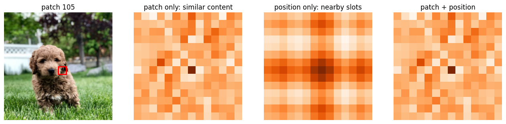
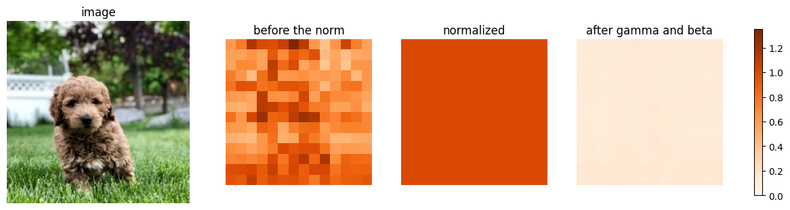

## Before We Begin

Show a 5 year old a photograph of a dog and ask what color it is. She will look at it and say "brown" without thinking twice.

Now try to explain how she did it.

Somewhere between the light hitting her eyes and the word leaving her mouth, a grid of colored dots became _a dog_. Then a string of sounds became _a question about the dog_. Then the two met, and out came an answer. She has no idea how any of this happened. For most of the history of computing, neither did we.

For a long time computers could not really _see_. We had to spell out exactly what to look for: edges, corners, colors, textures. Neural networks changed that. Instead of writing the rules, we could show a model millions of examples and let it learn the patterns for itself. Computer vision went from recognizing simple shapes to recognizing objects, faces and, eventually, entire scenes.

Language followed a similar path, as models went from predicting the next word to understanding increasingly complex relationships between words, sentences and ideas. Things got interesting when we joined the two kinds of models together and let them work as one.

Today models can look at an image, read a question about it and answer in plain language, with remarkable detail and accuracy. We call them **Vision Language Models**, or VLMs.

So how does a model built around language suddenly get to see? Under the hood, a VLM is several components stitched together: something that sees, something that reasons in language, and a bridge that lets the two talk to each other.

A computer doesn't see a dog. It sees a few hundred thousand numbers arranged in a grid, and nothing in those numbers says "dog". That is where a **Vision Encoder** comes in. Its job is to cut the image into small square patches, the way you might cut a photograph into tiles. On their own the tiles mean little. A patch of brown fur could belong to a dog, a bear, or a carpet. Meaning only emerges when the patches can _talk to each other_, when the patch with the ear can ask the patch with the snout what it's looking at. The mechanism that makes this conversation possible is called **Attention**. It is the single most important idea in modern AI, and you will implement it yourself in the chapters ahead. Stack enough layers of attention together and you get an **Encoder**, a machine that turns pixels into understanding.

But seeing is only half the job. The model also has to "_read_", and it has to hold the image and the words in its head at the same time. Here we run into a puzzle: images and words are completely different kinds of things. How do you put a picture _inside_ a sentence? The answer comes in two parts. First, a **Processor** prepares the image and the prompt, leaving room in the text for the picture to sit. Then a small bridge translates what the vision encoder saw into the same language the words are written in. Once that is done, a picture is no longer a foreign object. It becomes just another part of the sentence.

Finally, the model has to "_speak_". For this we need a **Language Model**, a **Decoder** that reads the combined sequence of image and words and writes its answer one word at a time. Each word it chooses is informed by everything that came before, including what it saw. Then we load pretrained weights into the model we built, write the **inference** loop, show it a picture and ask it a question. And it answers!

#### Isn't that cool? A few lines of code, arranged in the right order, give a machine the ability to see, something a 5 year old does naturally.

---

You don't need to be an expert to make this journey. If you know that a neural network is built from layers, that a linear layer multiplies its input by a matrix and adds a bias, and that we train models by measuring a loss and nudging the weights through backpropagation, you have everything you need. Everything else is explained as we go.

Read a chapter, then close the book and open the code editor. Try to write the code _before_ you feel ready. When you get stuck, and you will, come back and reread. That moment of being stuck is not a sign that something is wrong. It happens when the idea is being carved into your mind.

Don't try to memorize anything here. Memorized code is forgotten by next week. Understood code is yours forever. If you understand _why_ each piece exists and what problem would appear if you took it away, you will find something strange happens: the code starts to write itself.

So let's start our journey with the most basic question: **how does a machine understand meaning?**

---

# Chapter 1. Turning Data into Numbers

A machine doesn't see or read the way we do. It only deals in numbers. So before it can understand anything, we have to turn that thing into numbers that can be compared and learned from. Once a picture and a sentence are both represented as numbers, we can ask a simple question: **how close should their representations be if they mean the same thing?**

> **Main Idea: A matching image and caption should give a big dot product and every mismatched pair should give a small one.**

Eventually we want a vision encoder whose output a language model can use. But before we can connect vision and language, the image encoder has to learn which visual concepts go with which words. A photo of a dog and the words "a brown dog" should mean the same thing, and since a neural network only understands numbers, that shared meaning has to show up in the numbers. So we need a way to turn a picture or a sentence into numbers we can compare.

### Embedding vectors

An embedding is a list of numbers that stands for something: a word, a sentence, an image or anything else. A list of numbers like this is called a **vector**, so embeddings are often called embedding vectors. If two things mean similar things, we want their vectors to point in similar directions.

The standard way to measure how similar two vectors are is the dot product. You multiply the numbers position by position and add them up:

$$\mathbf{a} \cdot \mathbf{b} = \sum_{i=1}^{n} a_i b_i$$

where $a_i$ and $b_i$ are the $i$-th numbers of $\mathbf{a}$ and $\mathbf{b}$, and $n$ is how many numbers each vector holds.

The dot product also equals $|\mathbf{a}|,|\mathbf{b}|\cos\theta$, where $\theta$ is the angle between the vectors. It tells two tales: how long the vectors are and which way they point. To measure direction only, we first normalize each vector to length 1, so that $|\mathbf{a}| = |\mathbf{b}| = 1$ and the dot product becomes exactly $\cos\theta$ _(the cosine similarity)_.

If both vectors point the same way, the dot product is $1$. If they are perpendicular (orthogonal) it is $0$, and if they point in opposite directions it is $-1$.

_(CLIP, which we meet later in this chapter, always normalizes its vectors this way.)_

Now we need data that teaches the encoders to place an image vector and a caption vector close together when they describe the same thing, and far apart when they don't. That data has to tell us which images and which words belong together.

### A pile of pictures


Imagine you have a huge pile of pictures, and each picture comes with a short description. A photo of a dog with the caption "a brown dog on the grass".

You build two encoders. An image encoder turns a picture into a vector. A text encoder turns a caption into a vector. Each encoder ends with a linear projection into a shared space of the same dimension $d$, so both vectors have the same number of entries and you can take their dot product. Both are then normalized to length 1.

Now take a batch of $N$ pictures and their $N$ captions. Encode them all. You get $N$ image vectors and $N$ text vectors. Compute the dot product of every image with every caption. You get a table $S$ with $N$ rows and $N$ columns.

Row $i$ is image $i$, column $j$ is caption $j$, and the cell at row $i$ column $j$ is how similar the model thinks image $i$ and caption $j$ are.

Picture $i$ goes with caption $i$. So the correct pairs are the cells where the row number equals the column number, $S_{ii}$. That is the diagonal of the table. Every cell off the diagonal, $S_{ij}$ with $i \neq j$, is a wrong pair. There are $N$ right pairs and $(N^2 - N)$ wrong ones.


**Training both encoders so that the diagonal cells become large and every other cell becomes small is called contrastive learning. The model learns by contrasting the right pair against all the wrong ones.**

But the encoders start with random weights, so the diagonal starts no brighter than any other cell, and since nobody can set millions of weights by hand, the model has to **learn** them: measure how far the table is from what we want, nudge every weight a little toward better, and repeat for every batch.

Measuring how far off the table is takes a single number, big when the diagonal is dim and small when it shines. That number is the **loss**, and backpropagation tells every weight in both encoders which way to move to shrink it. So the question becomes: how do we turn an $N \times N$ table of similarities into one number?

### How CLIP turns this into a loss

[CLIP](https://openai.com/index/clip/), from OpenAI, is the model that made this kind of training famous. To see its loss you first need to know how language models are trained, because CLIP borrows the same trick.

A language model reads "leaning tower of" and has to guess the next word. It outputs one score for every word in its vocabulary. These raw scores are called logits, and we write them as $z_1, z_2, \dots, z_V$ where $V$ is the size of the vocabulary. We want the score for "pisa" to be the highest.

To compare scores with a correct answer, we first turn the scores into a probability distribution with a function called **softmax**. For each score it computes the exponential and then divides by the sum of the exponentials of all scores. The results are all positive and add up to 1, $\sum_k p_k = 1$.

$$p_k = \text{softmax}(z)_k = \frac{e^{z_k}}{\sum_{j=1}^{V} e^{z_j}}$$

where $p_k$ is the probability the model gives to word $k$, $z_k$ is that word's logit, and $j$ is a counter that runs over all $V$ words.

The **cross entropy loss** looks at the probability given to the correct answer and punishes the model when it is low. The correct answer is given as a label $y$, which is just the index of the right class. If "pisa" is word number 72 in the vocabulary, the label is $y = 72$ and the loss is

$$\mathcal{L} = -\log p_y$$

where $\mathcal{L}$ is the loss and $p_y$ is the probability the model gives to the correct word.

If the model gives the right word probability close to 1, $\log 1 = 0$ and the loss is almost zero. If it gives it a tiny probability, the log is a big negative number and the loss is large. This loss fits any problem with many candidates and exactly one right answer.

Now look back at our table $S$. Image 0 is compared against $N$ captions, and only caption 0 is right. That is the same kind of problem, so we can use the same loss.

CLIP does the same thing to its table. Take row 0. It holds the similarity of image 0 with every caption, $S_{0,0}, S_{0,1}, \dots, S_{0,N-1}$. Treat those $N$ numbers as scores over $N$ classes. The right class is caption 0, so the label is 0. For row 1 the label is 1. For row $i$ the label is $y_i = i$. So the labels for all rows are simply $0, 1, 2, \dots, N-1$, which is exactly what `np.arange(n)` produces.

CLIP does this once along the rows, which asks each image to pick its caption, and once along the columns, which asks each caption to pick its image. The final loss is the average of the two

$$\mathcal{L} = \frac{1}{2}\left(\mathcal{L}_{\text{img}} + \mathcal{L}_{\text{txt}}\right)$$

where $\mathcal{L}_{\text{img}}$ is the cross entropy averaged over the $N$ rows (every image picking its caption) and $\mathcal{L}_{\text{txt}}$ is the same averaged over the $N$ columns (every caption picking its image).

But there is a problem. Cosine similarities can never leave $[-1, 1]$, so the right caption can beat a wrong one by at most 2, and softmax cannot turn such small gaps into a confident answer. Take a perfect table, where the right caption scores $1$ and every wrong one scores $-1$. With CLIP's batch of $N = 32{,}768$, the right caption gets probability

$$p = \frac{e^{1}}{e^{1} + 32{,}767 \cdot e^{-1}} \approx 0.00023$$

and the loss is still about $8.4$. The encoders cannot possibly do better than this, yet the loss keeps punishing them.

To fix this, every cell of the table is multiplied by $e^{t}$ before the loss, where $t$ is a learned number called the **temperature**. The model now works with $S_{ij} \cdot e^{t}$, which lets it stretch the similarities far beyond $[-1, 1]$ and decide for itself how sharp the softmax should be.


Here is the whole CLIP loss,`I_e` and `T_e` are the normalized image and text embeddings, each of shape $[N, d]$.

```python
logits = np.dot(I_e, T_e.T) * np.exp(t)     # the N x N table, stretched by the temperature
labels = np.arange(n)                       # row i should pick column i
loss_t = cross_entropy_loss(logits, labels, axis=0) # softmax across column, each caption picks its image 
loss_i = cross_entropy_loss(logits, labels, axis=1) # softmax across row, each image picks its caption
loss = (loss_i + loss_t) / 2
```

The loss is complete, and the temperature fixed our problem. But it quietly created a new one. CLIP starts with $e^{t} \approx 14.3$ and lets it grow up to $100$, so the logits entering softmax no longer sit between $-1$ and $1$. They can reach $100$, and softmax exponentiates them. Can a computer even hold $e^{100}$?

### Why softmax is dangerous and how to fix it

The exponential grows very fast. $e^{100}$ is roughly 26881171418161354484126255515800135873611118, a number with 44 digits. Computers store numbers in a fixed number of bits, usually 16 or 32, so every format has a largest value it can hold. A 16 bit float (FP16) cannot go past $65504$, and $e^{12}$ is already bigger than that. Once an exponential passes that limit it becomes infinity, infinity divided by infinity is NaN (not a number), and training breaks.

To fix it, notice that softmax is a fraction, and multiplying the top and the bottom of a fraction by the same number does not change it. So multiply both by $e^{-c}$ for some constant $c$. Because $e^{z_k} \cdot e^{-c} = e^{z_k - c}$, this is the same as subtracting $c$ from every score before the exponential

$$\frac{e^{z_k}}{\sum_j e^{z_j}} = \frac{e^{-c} e^{z_k}}{e^{-c}\sum_j e^{z_j}} = \frac{e^{z_k - c}}{\sum_j e^{z_j - c}}$$

The factor cancels and the output is identical.


Pick $c$ to be the largest score in the vector, $c = \max_j z_j$. Now the largest value becomes $e^{0} = 1$, and everything else is smaller than 1. Nothing can overflow. In code we write it as:

```python
import numpy as np

def naive_softmax(x):
    e = np.exp(x)
    return e / e.sum()
    
def stable_softmax(x):
    z = x - x.max()          # the largest score becomes 0
    e = np.exp(z)            # every value is now at most 1
    return e / e.sum()

x = np.array([1000.0, 999.0, 998.0])
with np.errstate(over="ignore", invalid="ignore"):
    print("naive  ", naive_softmax(x))
print("stable ", stable_softmax(x))
```

**Output:**

```text
naive  [nan nan nan]
stable [0.66524096 0.24472847 0.09003057]
```

So softmax is safe now. Is it perfect? Not quite. Look at what the trick needs. To compute the probability of a single cell, we first need $c = \max_j z_j$, the largest score in the _entire_ row, and then the sum $\sum_j e^{z_j - c}$, again over the entire row. Every probability depends on every other score in its row. For a language model predicting one word, that is fine. For CLIP's giant table, it becomes a bottleneck.

### The problem with CLIP at scale

Contrastive learning gets better as the batch grows (more on why below), so we want $N$ as large as the hardware allows. CLIP used $N = 32{,}768$, and the cost of its loss grows with $N$.

To compute softmax for one row, you must first find the maximum of the whole row, then exponentiate everything, then sum the whole row, $\sum_{j=1}^{N} e^{S_{ij}}$. A device computing that row needs the entire row in its memory. The same goes for columns and CLIP needs both.

This makes it hard to split the table across many GPUs, and it makes very large batch sizes painful. Large batches matter in contrastive learning because more wrong pairs give the model more to contrast against. With a batch of $N$ you get $(N^2 - N)$ wrong pairs, so doubling the batch roughly quadruples the negatives.

The root of the problem is softmax itself. Its denominator ties every cell in a row together (and, for the second loss, every cell in a column), so no cell can be scored on its own. That raises a question: do the cells really need to compete? What if we asked each pair on its own, _is this a match or not_?

### The sigmoid loss

A later model, [SigLIP](https://arxiv.org/abs/2303.15343), says no. Its **sigmoid loss** stops treating each row as a competition between $N$ captions and treats every single cell as its own yes or no question: **do this image and this caption match?**

This is a binary classification task, and the tool for it is the sigmoid function.

**Sigmoid takes any number and squashes it into a value between 0 and 1.**



$$\sigma(s) = \frac{1}{1 + e^{-s}}$$

where $\sigma$ (sigma) is the sigmoid and $s$ is any score, for us a single cell $S_{ij}$. A big positive $s$ gives something close to 1, a big negative $s$ gives something close to 0, and $s = 0$ gives exactly $0.5$.

Each cell gets a label $y_{ij}$ that is 1 on the diagonal and 0 everywhere else

$$y_{ij} = \begin{cases} 1, & \text{if } i = j \ 0, & \text{if } i \ne j \end{cases}$$

We push $\sigma(S_{ij})$ toward 1 for the diagonal and toward 0 for every other cell, using the usual binary cross entropy for each cell

$$\mathcal{L}_{ij} = -\Big[y_{ij}\log \sigma(S_{ij}) + (1 - y_{ij})\log\big(1 - \sigma(S_{ij})\big) \Big]$$

and the total loss is the average over all $N^2$ cells.

The formula looks busy, but only one of its two terms is ever switched on. On the diagonal $y_{ij} = 1$, the second term vanishes and the loss is $-\log \sigma(S_{ij})$, which is small only when $\sigma(S_{ij})$ is close to 1. Off the diagonal $y_{ij} = 0$, the first term vanishes and the loss is $-\log\big(1 - \sigma(S_{ij})\big)$, which is small only when $\sigma(S_{ij})$ is close to 0.

The real sigmoid loss also learns a bias $b$ next to the temperature, so the model can shift all scores at once. That helps at the start of training, when almost every cell is a negative.

A batch of 4 images and 4 captions gives a table of $4^2 = 16$ cells. The 4 diagonal cells are matches with label 1. The other $16 - 4 = 12$ are non matches with label 0. In general a batch of $N$ gives $N$ positives and $(N^2 - N)$ negatives.

```python
import torch
import torch.nn.functional as F

# sigmoid loss

def sigmoid_loss(img_emb, txt_emb, t, b):
    logits = img_emb @ txt_emb.T * t.exp() + b   # [N, N]
    labels = torch.eye(logits.size(0))           # 1 on the diagonal, 0 elsewhere

    return F.binary_cross_entropy_with_logits(logits, labels) # sigmoid + BCE in one stable call, averaged over all N^2 cells

# toy batch; every cell is yes/no
N, d = 4, 8
img = F.normalize(torch.randn(N, d), dim=-1)
txt_random = F.normalize(torch.randn(N, d), dim=-1)
txt_matching = img.clone()                     # a perfect encoder would give this
t, b = torch.tensor(2.3), torch.tensor(-3.0)

print("positives", N, "| negatives", N * N - N)
print("loss with random captions:", sigmoid_loss(img, txt_random, t, b).item())
print("loss with matching captions:", sigmoid_loss(img, txt_matching, t, b).item())
```

**Output:**

```
positives 4 | negatives 12
loss with random captions: 0.6071510910987854
loss with matching captions: 0.2847801446914673
```

The big win is independence. No cell needs to know about any other cell. Look at $\mathcal{L}_{ij}$ again, it only uses $S_{ij}$. There is no row maximum and no row sum. So you can cut the table into blocks, send each block to a different device and compute them separately. This is why the sigmoid loss scales to batches of a million pairs.


Now let's step back and look at what we have done so far. We set out to build a model that can see and talk, and so far we have trained two encoders against each other. What do we actually keep?

Our vision language model only keeps the image encoder from this training, not the text one. Why pick an encoder trained this way rather than a plain image classifier?

Because its image vectors were trained to line up with language. They already carry the kind of meaning text cares about. Also this training data is cheap. The internet is full of images with descriptions, like Wikipedia captions or the alt text of HTML images, which is the text shown when an image fails to load. Some descriptions are wrong or noisy, but with billions of examples the model still learns good representations.



That image encoder takes in a picture and produces a vector, and we still have no idea what happens inside. Time to build one ourselves.

---

# Chapter 2. Vision Transformer

At the end of the last chapter we left the image encoder as a black box: a picture goes in, a vector comes out. Now we open it. **The encoder we are going to build is a Transformer**, and a Transformer does not take images directly. So before we can build one for images, we must know what a Transformer expects to be fed.

### What a Transformer is, just enough

The Transformer was introduced in 2017, in the paper "[Attention Is All You Need](https://arxiv.org/abs/1706.03762)", to translate text from one language to another. You don't need its details yet, the upcoming chapters build it piece by piece. You only need its contract, the promise it makes about what goes in and what comes out.

A Transformer takes a list of vectors. Each item in the list is called a **token**. In text, a token is a word or a piece of a word. It becomes a vector through an **embedding table**, a big matrix with one row per token in the vocabulary. Every token has an id, a whole number, and the id simply picks its row. The word "dog" might be id 3290, so its vector is row 3290 of the table. The rows start random and are learned during training, just like the encoder weights in chapter 1.

The Transformer is a stack of identical **layers**. Each layer takes a list of $N$ vectors and returns a list of $N$ vectors, each of the same length as before. Nothing is added and nothing is removed. What changes is the content: every output vector is rewritten using information from the _other_ vectors in the list. The part of the layer that lets tokens look at each other is called **attention**. After enough layers, the vector for the word "bank" knows whether the sentence was about rivers or money.

We will write the shape of that list as $[B, N, D]$. A shape lists how many entries a tensor has along each axis, so $[B, N, D]$ is a 3D block of numbers: $B$ examples, each holding $N$ tokens, each token holding $D$ numbers. $B$ is the batch size (how many examples we process at once), $N$ is the number of tokens (code often calls it `seq_len`) and $D$ is the length of each token vector (the embedding dimension, called `hidden_size` in the config and `embed_dim` inside some modules; all three names mean the same number).

A Transformer where every token may look at every other token is called an **encoder**. That is what we build here. A Transformer where each token may only look at the tokens before it is called a **decoder**. That is the language model.

Notice what the contract does _not_ say: it never mentions words. A Transformer takes a list of vectors and returns a list of vectors. If we can turn an image into a list of vectors, the same machine should work.

So how do we turn an image into a list?

### Why not one token per pixel

An image arrives as a grid of pixel values, three numbers (red, green, blue, or RGB) for every pixel. The obvious move is to make every pixel a token.

But a $224 \times 224$ image has $50{,}176$ pixels, and attention compares every token with every other token. That is $50{,}176^2 \approx 2.5$ billion scores, for every layer. Stored as 32 bit floats, 4 bytes each, that one table alone takes about 10 GB, for a single image in a single layer. And a single pixel means almost nothing on its own anyway, it is just a dot of color.

So we need bigger pieces: a way to cut the image into a sequence short enough to afford, where each token is big enough to mean something.

### The Vision Transformer idea

Text is already a sequence. An image is a grid. The **Vision Transformer**, or **ViT**, from the paper "[An Image Is Worth 16x16 Words](https://arxiv.org/abs/2010.11929)", turns the grid into a sequence by cutting the image into square patches and treating each patch as a token.

Our image encoder is a Vision Transformer.

The title of that paper is the whole idea. A $16 \times 16$ patch plays the role of a word. A $224 \times 224$ image cut this way gives $196$ patches instead of $50{,}176$ pixels, so attention computes $196^2 = 38{,}416$ scores instead of about 2.5 billion. Each patch holds $16 \times 16 = 256$ pixels, so there are 256 times fewer tokens. The number of scores grows with the _square_ of the number of tokens, so there are $256^2 = 65{,}536$ times fewer scores.

That is the paper's first message. The second is just as important: once the image is a sequence of patch vectors, **nothing else needs to change**. The layers are the same ones used for text.

### Say hello to ViT

Before we build the first piece, here is the whole machine, so you always know where the piece you are building fits.



A $224 \times 224$ photo comes in. It is cut into a grid of $16 \times 16$ pixel patches, 14 across and 14 down, so 196 patches. One layer then looks at each patch and turns its pixels into a list of 768 numbers. Now we have 196 vectors, one per patch, and each one describes what its patch _looks like_. But cutting the image into a list lost track of where each patch was, so we add a second vector to each one that says which slot it came from.

The list then enters the big box in the middle, the **Transformer encoder**. It is a stack of identical layers, 12 in our config, and every layer does the same four things in the same order. A **norm** keeps the numbers at a steady scale, so they don't blow up or fade away as they pass through many layers (the next chapter). Then **attention**, where the patches finally talk: each patch looks at every other patch and borrows what is useful. Then another norm, and an **MLP**, a small network that works on each patch's vector by itself and digests what attention just gathered. (Each layer also has two shortcuts that add its input back to its output. We will meet them when we build the layer.) After the last layer comes one final norm, and out come 196 vectors.

Going in, the vector for a patch of brown fur only knew it was brown fur. Coming out, it has seen the ear, the snout and the grass, so it knows it is fur _on a dog_. Same patch, same slot, but its vector now carries its context.

You will also notice two greyed out boxes, **CLS** and **MLP head**. They belong to a version of the ViT that we don't build, and we come back to them right after this walk.

Here is the same walk again, with the shape of the data after every step.

```text
  image                      [B, 3, 224, 224]     batch, channels, height, width
  cut and embed patches      [B, 768, 14, 14]
  grid to sequence           [B, 196, 768]
  + position vectors         [B, 196, 768]
  12 encoder layers          [B, 196, 768]
  final norm                 [B, 196, 768]
```

The first shape puts the 3 color channels _before_ height and width. That is the order PyTorch layers expect. An image loaded from a file comes the other way round, as height, width, channels, so the processor we build later moves the channels to the front. Why the second shape puts 768 in front of the grid will be explained later in the chapter.

Look at the column of shapes. After the patches become a sequence, the shape never changes again. That is the Transformer contract at work, $N$ vectors in, $N$ vectors out. The 196 vectors that come out are the 196 that went in, each one rewritten by everything it learned from the others.

If you read about the Vision Transformer anywhere else, you will meet one difference: the number 197. The original ViT was built to classify images, "this is a dog". It borrowed a trick from a text model called BERT and put one extra learnable vector at the front of the sequence, called the **CLS** token, short for classification. It carries no patch. It travels through all the layers collecting information from the patches, and at the end only the CLS vector goes into a small classification head that outputs one score per class. That is $196 + 1 = 197$ tokens.

We don't need any of that. We are not classifying, we want the language model to see the whole image, patch by patch. So our encoder has no CLS token and no classification head. That is why they are greyed out in the figure. Our sequence has exactly 196 tokens.

### Configuring

Before we write any layer, we need one place to keep the numbers every layer will ask for: how long each token vector is, how big the image is, how big a patch is, how many layers to stack.

Every module you build reads its sizes from a config object. Start `vision_encoder.py` with it.

```python
class VisionConfig:
    def __init__(
        self,
        hidden_size=768,           # D, length of every token vector
        intermediate_size=3072,    # width inside the MLP
        num_hidden_layers=12,      # how many encoder layers are stacked
        num_attention_heads=12,    # attention heads per layer
        num_channels=3,            # red, green, blue
        image_size=224,            # images are resized to 224 x 224
        patch_size=16,             # each patch is 16 x 16 pixels
        layer_norm_eps=1e-6,       # small number that prevents division by zero
        attention_dropout=0.0,     # dropout inside attention, 0 means switched off
        num_image_tokens=None,     # image tokens the processor reserves, set from the real config
        **kwargs                   # swallows any extra keys from the pretrained config file
    ):
        self.hidden_size = hidden_size
        self.intermediate_size = intermediate_size
        self.num_hidden_layers = num_hidden_layers
        self.num_attention_heads = num_attention_heads
        self.num_channels = num_channels
        self.image_size = image_size
        self.patch_size = patch_size
        self.layer_norm_eps = layer_norm_eps
        self.attention_dropout = attention_dropout
        self.num_image_tokens = num_image_tokens
```

These defaults are the sizes of the base model from the ViT paper. We use them throughout this chapter because they are easy to follow. The pretrained model we load later is several times bigger (vectors of length 1152, 27 layers, 16 heads), but you won't have to change a single line of code for it. Every module reads its sizes from this config, and when the real model is loaded, its own config file simply replaces these numbers.

The only difference worth remembering now is one number. The real model cuts its images into 14 pixel patches instead of 16. A 224 image then gives $224 / 14 = 16$ patches per side and $16 \times 16 = 256$ patches instead of 196. When you see 256 in a later chapter, that is where it comes from.

### Counting patches

Before we cut anything, how many tokens will we end up with?

If the image is $H = 224$ pixels wide and each patch is $P = 16$ pixels wide, you get $224 / 16 = 14$ patches across. The same number down. So $14 \times 14 = 196$ patches. (Our images are square, so $H$ stands for both the height and the width.)

The rule is

$$N_{\text{patches}} = \left(\frac{H}{P}\right)^2$$

where $H$ is the image size in pixels and $P$ is the patch size in pixels.

In code, `self.num_patches = (self.image_size // self.patch_size) ** 2`. The `//` is integer division, it throws away any remainder. If the image size were not a multiple of the patch size, the leftover strip of pixels at the edge would simply be ignored.

The token count grows fast with resolution. The model family we load also comes in a high resolution version that reads images of 896 pixels with the same 14 pixel patches. That is $896 / 14 = 64$ per side and $64^2 = 4096$ patches, so 4096 image tokens, 16 times more than at 224.


### Look at your patches

Numbers are easy to nod along to. Before going further, cut a real photo into patches and look at them. Take any photo, resize it to $224 \times 224$ (a photo that is not square gets squashed a little, which is fine here), and slice it into its $14 \times 14$ grid with nothing but NumPy.

The only tricky line is the `reshape`. Any row index $h$ between 0 and 223 can be written as $h = 16a + b$, where $a$ (0 to 13) says which row of patches the pixel is in and $b$ (0 to 15) says which pixel row inside that patch. Reshaping the height axis of 224 into two axes of 14 and 16 splits every row index into exactly this $(a, b)$ pair. The same happens to the width. After that, the transpose brings the two "which patch" axes to the front, so `patches[r, c]` is one whole $16 \times 16$ tile.

```python
import numpy as np
import matplotlib.pyplot as plt
from PIL import Image

image = Image.open("dog.jpg").convert("RGB").resize((224, 224))
x = np.array(image)                                      # [224, 224, 3], height, width, channels
P = 16
n = 224 // P                                             # 14 patches per side

# split height into (14 blocks, 16 rows) and width into (14 blocks, 16 columns)
patches = x.reshape(n, P, n, P, 3)                       # [14, 16, 14, 16, 3]
patches = patches.transpose(0, 2, 1, 3, 4)               # [14, 14, 16, 16, 3], dims 1 and 2 swapped so each patch is whole

fig, axes = plt.subplots(n, n, figsize=(7, 7))
for r in range(n):
    for c in range(n):
        axes[r, c].imshow(patches[r, c])                 # patch number r * 14 + c
        axes[r, c].axis("off")
plt.subplots_adjust(wspace=0.05, hspace=0.05)
plt.show()
```

**Output:**



You will see the photo with thin white gaps between 196 small tiles. Some tiles are obviously an eye or a nose. Most are just fur, grass or trees, and on their own could belong to almost anything. That is exactly what the encoder layers will have to fix later, by letting each tile ask the others what they see.

Now we know how many patches we want. How do we actually cut them out, and turn each one into a vector? The naive way would be to slice the image into 196 tiles like we just did, flatten each tile's $16 \times 16 \times 3 = 768$ numbers into a list, and multiply every list by the same weight matrix. It turns out one layer already does all of that in a single call.

### Cutting patches with a convolution

A 2D convolution slides a small window, called the kernel, across an image. At each position it multiplies the pixels under the window by learned weights, adds them up and adds one learned bias, giving one number. Color images have three channels, red, green and blue, so the kernel covers all three at once. A $16 \times 16$ kernel over 3 channels looks at $16 \times 16 \times 3 = 768$ pixel values and turns them into one number. A layer can hold many kernels, each producing its own output channel, so with 768 output channels you get 768 numbers for every window position.

The two 768s here are a coincidence of this config. The first is how many pixel values one window sees, the second is `hidden_size`, the length we want each token vector to have. With 14 pixel patches a window sees $14 \times 14 \times 3 = 588$ values, but the output length is still whatever `hidden_size` says.

The stride is how far the window jumps between positions. If the kernel is 16 and the stride is also 16, the window jumps exactly one patch at a time. No overlap and no gaps. Each window position sees exactly one patch and turns it into 768 numbers. That is exactly what we wanted, one vector per patch, and it is called a **patch embedding**.


The padding is set to `"valid"`, which means no extra border is added around the image. Since 224 divides evenly by 16, there is nothing left over at the edges that would need a border.

So `nn.Conv2d(in_channels=3, out_channels=768, kernel_size=16, stride=16, padding="valid")` takes an input of shape $[B, 3, 224, 224]$ and gives $[B, 768, 14, 14]$. The output is still a grid, 14 by 14, where each cell holds a 768 long vector.

### Convolution by hand

That description is a lot of words for a simple operation. Let's do one small enough to compute in your head. A grayscale image, so 1 channel, of $4 \times 4$ pixels, a $2 \times 2$ kernel, stride 2 and no bias.

$$\text{image} = \begin{pmatrix} 3 & 5 & 1 & 9 \\ 2 & 7 & 4 & 6 \\ 8 & 0 & 5 & 3 \\ 1 & 6 & 2 & 4 \end{pmatrix} \qquad \text{kernel} = \begin{pmatrix} 1 & 0 \\ 0 & -1 \end{pmatrix}$$

The window starts at the top left and sees the patch $\begin{pmatrix} 3 & 5 \\ 2 & 7 \end{pmatrix}$. Multiply each pixel by the kernel weight in the same spot and add everything up

$$3 \cdot 1 + 5 \cdot 0 + 2 \cdot 0 + 7 \cdot (-1) = 3 - 7 = -4$$

Jump 2 pixels right. The window sees $\begin{pmatrix} 1 & 9 \\ 4 & 6 \end{pmatrix}$ and gives $1 - 6 = -5$. Jump down to the bottom left, $\begin{pmatrix} 8 & 0 \\ 1 & 6 \end{pmatrix}$ gives $8 - 6 = 2$. Bottom right, $\begin{pmatrix} 5 & 3 \\ 2 & 4 \end{pmatrix}$ gives $5 - 4 = 1$.

Four patches, four numbers, and they land in a $2 \times 2$ grid in the same arrangement as the patches they came from

$$\text{output} = \begin{pmatrix} -4 & -5 \\ 2 & 1 \end{pmatrix}$$


(If you met convolution in a signal processing class, you may remember the kernel being flipped first. Deep learning libraries skip the flip, strictly that is called cross correlation, but everyone calls it convolution. Since the weights are learned, the flip would make no difference.)

PyTorch gives the same result.

```python
import torch
import torch.nn as nn

img = torch.tensor([[3., 5., 1., 9.],
                    [2., 7., 4., 6.],
                    [8., 0., 5., 3.],
                    [1., 6., 2., 4.]]).reshape(1, 1, 4, 4)       # [B, C, H, W]

conv = nn.Conv2d(in_channels=1, out_channels=1, kernel_size=2, stride=2, bias=False)
conv.weight.data = torch.tensor([[1., 0.],
                                 [0., -1.]]).reshape(1, 1, 2, 2)  # [out_channels, in_channels, K, K]
print(conv(img).detach())
```

**Output:**

```text
tensor([[[[ -4., -5.],
          [  2.,  1.]]]])
```

This toy has one output channel, so each patch became one number. Our real layer has 768 output channels, 768 different kernels, so each patch becomes 768 numbers, one from each kernel. That is the patch vector.

### A convolution is a linear layer in disguise

Look at the first patch again. Read its pixels row by row into a list, $[3, 5, 2, 7]$, and do the same with the kernel, $[1, 0, 0, -1]$. The dot product of the two lists is

$$3 \cdot 1 + 5 \cdot 0 + 2 \cdot 0 + 7 \cdot (-1) = -4$$

the same number the convolution produced. That is not a coincidence. When the stride equals the kernel, every window sees its own patch and nothing else, so the convolution is exactly this: flatten each patch into a list, and multiply it by a weight matrix, the same matrix for every patch, then add the bias. With 768 kernels, the weight matrix has one row per kernel. In other words, a linear layer applied to every flattened patch.

This matters because the ViT paper describes the patch embedding this way. It says it will "flatten the patches and map to D dimensions with a trainable linear projection", with no convolution in sight. Our code uses a convolution. They are the same computation written two ways, and here is the proof. Cut the patches by hand, multiply them by the convolution's own weights reshaped into a matrix, add its bias, and compare.

```python
conv = nn.Conv2d(in_channels=3, out_channels=768, kernel_size=16, stride=16)
x = torch.randn(1, 3, 224, 224)

# the convolution way
out_conv = conv(x).flatten(2).transpose(1, 2)                     # [1, 196, 768]

# the paper way, flatten every patch and multiply by one matrix
patches = x.unfold(2, 16, 16).unfold(3, 16, 16)                  # [1, 3, 14, 14, 16, 16], windows along height (dim 2) then width (dim 3)
patches = patches.permute(0, 2, 3, 1, 4, 5)                      # [1, 14, 14, 3, 16, 16], each patch's channels and pixels together
patches = patches.reshape(1, 196, 3 * 16 * 16)                   # [1, 196, 768], one flat list per patch
W = conv.weight.reshape(768, -1)                                 # [768, 768], one row per kernel
out_linear = patches @ W.T + conv.bias                           # [1, 196, 768]

print(torch.allclose(out_conv, out_linear, atol=1e-4))
```

**Output:**

```text
True
```

(`flatten(2).transpose(1, 2)` on the first line turns the conv's grid into a list of 196 vectors so the two results can be compared. We explain it properly later in the chapter.)


The code below splits our dog image into 196 patches from earlier and shows them as sequence and the matrix form.

```python
import numpy as np
import matplotlib.pyplot as plt
from PIL import Image

image = Image.open("dog.jpg").convert("RGB").resize((224, 224))
x = np.array(image)                                      # [224, 224, 3]
P = 16
n = 224 // P                                             # 14

patches = x.reshape(n, P, n, P, 3).transpose(0, 2, 1, 3, 4)   # [14, 14, 16, 16, 3]
seq     = patches.reshape(n * n, P, P, 3)                     # [196, 16, 16, 3], k = r * 14 + c
flat    = seq.reshape(n * n, -1)                              # [196, 768], one row per patch 

fig, ax = plt.subplots(figsize=(7, 7))
ax.imshow(x)

for i in range(1, n):
    ax.axhline(i * P, color="white", lw=0.5)
    ax.axvline(i * P, color="white", lw=0.5)
for r in range(n):
    for c in range(n):
        ax.text(c*P + P/2, r*P + P/2, r*n + c, color="yellow", fontsize=6, ha="center", va="center")
ax.set_title("image → 14×14 = 196 patches"); ax.axis("off")
plt.show()

# first 28 patches as a sequence (rows 0 and 1 of the grid)
fig, axes = plt.subplots(1, 28, figsize=(20, 1.5))
for k in range(28):
    axes[k].imshow(seq[k]); axes[k].set_title(k, fontsize=7); axes[k].axis("off")
plt.suptitle("sequence order: patch 0, 1, 2, ... (row by row)", y=1.15)
plt.show()

# the whole sequence as a matrix: 196 patches × 768 pixel values
plt.figure(figsize=(10, 4))
plt.imshow(flat, aspect="auto", cmap="gray"
plt.xlabel("768 values = 16 × 16 × 3"); plt.ylabel("patch index 0–195")
plt.title("[196, 768]: input to the patch embedding")
plt.show()

print(x.shape, "→", patches.shape, "→", seq.shape, "→", flat.shape)
```

**Output:**





```text
(224, 224, 3) → (14, 14, 16, 16, 3) → (196, 16, 16, 3) → (196, 768)
```

So why use the convolution at all? Because it is one line, it cuts and multiplies in a single call, and it is heavily optimized on GPUs. And because the pretrained weights we load are stored in this shape.
### Why not a CNN?

We just used a convolution to cut patches, and before 2020 most of the best vision models were **convolutional neural networks**, or CNNs, built from many stacked convolutions. So why not use a whole CNN as the image encoder?

A CNN stacks many convolutions with small kernels, typically $3 \times 3$, that slide one pixel at a time, so the windows overlap heavily. Each layer only looks at a small neighborhood of the layer below. For the dog's ear to relate to its tail, information has to travel there layer by layer, the view widening a little each time.

That design bakes in two assumptions. Nearby pixels belong together, and a pattern means the same thing wherever it appears in the image. Assumptions built into a model's design, instead of learned from data, are called **inductive bias**. For images they are usually true, so a CNN learns well from relatively little data.

A ViT throws almost all of that away. Its only image specific parts are the patch cutting and the position vectors. From the very first layer, attention lets any patch look at any other patch, near or far. The price is that the model has to _learn_ from data that neighbors usually matter, because nobody told it.


The ViT paper measured this trade. Trained on ImageNet alone, about 1.3 million images, ViT lost to strong CNNs. Pretrained on JFT-300M, a private Google dataset of about 300 million images, it beat them, and the largest ViTs gained the most from the extra data.

Now remember chapter 1. Our encoder learns from billions of image and caption pairs taken from the web. Data is the one thing we have in abundance, and that is where ViT wins.

One thing not to confuse. Our patch layer is a convolution, but it is not a CNN. It is a single layer whose windows never overlap. It only cuts the image and projects each patch. All the seeing is left to the Transformer.

### When windows overlap

What would happen if ours did overlap, the way a CNN's windows do? That happens whenever the stride is smaller than the kernel. For image size $H$, kernel $K$ and stride $S$, the number of positions that fit along one side is

$$\left\lfloor \frac{H - K}{S} \right\rfloor + 1$$

where the $\lfloor \cdot \rfloor$ brackets mean "round down to a whole number", since a window that only half fits is not counted. The $+1$ counts the very first window, the one at the left edge before any jump.

With $K = 16$ and $S = 8$ on a 224 image that is $\frac{224 - 16}{8} + 1 = 26 + 1 = 27$. So $27 \times 27 = 729$ patches, each sharing half its pixels with its neighbor. More tokens, more compute. When $S = K$ the formula becomes $\frac{H - K}{K} + 1 = \frac{H}{K}$, which is our $H / P$ again.


(The figure compares stride 8 and stride 4 along one row of pixels. In 2D both sides count, so a 224 image with kernel 16 and stride 8 gives $27 \times 27 = 729$ patches.)

Overlap is what gives a CNN its slowly widening view, but in our patch layer it would only multiply the tokens, and attention pays for every token squared: 729 tokens instead of 196 means about 14 times more scores. So our patch layer keeps the stride equal to the kernel.

### From grid to sequence

Back to our patch layer. The convolution gave us one vector per patch. But look at the shape, $[B, 768, 14, 14]$. The patches are still arranged as a $14 \times 14$ grid, and the 768 numbers of each patch come _before_ the grid, because a convolution always puts its output channels right after the batch. That is not the list of tokens a Transformer expects.

The Transformer wants a list, not a grid. Number the dimensions of $[B, 768, 14, 14]$ as 0, 1, 2, 3. `flatten(2)` merges every dimension from index 2 onward into one, so $14 \times 14$ becomes $196$. The shape $[B, 768, 14, 14]$ becomes $[B, 768, 196]$. The grid is read row by row, so patch $(r, c)$ lands at position $14r + c$.

But now the embedding dimension (dimension 1) comes before the patch dimension (dimension 2). A Transformer expects one row per token, shape $[B, \text{tokens}, \text{embedding}]$. So we swap dimensions 1 and 2 with `transpose(1, 2)` and get $[B, 196, 768]$.


Now we have a sequence.

### Adding position

Flattening throws away where each patch was. Patch 0 was top left, patch 195 was bottom right, but the list does not say so.

Does that matter? Yes. Attention, which we build later, treats its input like a bag of tokens. Shuffle the patches and every patch gets exactly the same result, just in the shuffled order. Without positions, a picture and the same picture with its tiles scrambled would look identical to the model.

We fix this by adding a position vector to each patch

$$\mathbf{e}_i = \mathbf{x}_i + \mathbf{p}_i$$

where $\mathbf{x}_i$ is the embedding of patch $i$, $\mathbf{p}_i$ is the position vector for slot $i$, and $\mathbf{e}_i$ is what finally enters the Transformer. Since we add them, $\mathbf{p}_i$ must have the same length as $\mathbf{x}_i$, 768 numbers. A position is not a single number here, it is a whole vector.

These position vectors are not computed by a formula. They are learned. We create `nn.Embedding(num_positions, embed_dim)`, the same kind of embedding table we met at the start of this chapter, except the ids are now slot numbers instead of word ids. It holds one learnable 768 long vector per slot, a matrix of shape $196 \times 768$. Give it slot number $i$ and it hands back row $i$. Position vector 0 is always added to patch 0, vector 1 to patch 1, and so on. During training the model shapes these vectors into whatever helps it know where a patch sits.

To look them all up at once we need the numbers 0 to 195. We store them with `self.register_buffer("position_ids", torch.arange(num_positions).expand((1, -1)), persistent=False)`. A buffer is a tensor that belongs to the module and moves to the GPU with it, but is not a trainable weight. `expand((1, -1))` gives it a batch dimension of size 1, shape $[1, 196]$, where $-1$ means "keep this dimension as it is". `persistent=False` means it is not saved with the weights, since it is just the numbers 0 to 195 and can be rebuilt any time. Then the forward adds `self.position_embedding(self.position_ids)`, shape $[1, 196, 768]$, to the patches. The batch dimension of 1 is copied across all $B$ images automatically, which PyTorch calls broadcasting, so every image gets the same position vectors.

```python
    self.position_embedding = nn.Embedding(self.num_positions, self.embed_dim)
    self.register_buffer(
        "position_ids",
        torch.arange(self.num_positions).expand((1, -1)),   # [1, 196], the numbers 0 to 195
        persistent=False,
        )

    def forward(self, pixel_values):
        patch_embeds = self.patch_embedding(pixel_values)   # [B, D, 14, 14]
        embeddings = patch_embeds.flatten(2)                # [B, D, 196], dims 2 and 3 (the grid) merged into one
        embeddings = embeddings.transpose(1, 2)             # [B, 196, D], dim 1 (D) swapped with dim 2 (patches)
        embeddings = embeddings + self.position_embedding(self.position_ids)   # [B, 196, D], the [1, 196, D] positions broadcast over the batch
        return embeddings
```

### What the position vectors learn

Something strange should bother you here. The model is only ever given slot numbers, 0 to 195, in a line. Nobody tells it that slot 14 sits directly below slot 0, or that slot 13 is at the right edge and slot 14 back at the left. As far as the model knows, it is reading a sentence.

Yet the ViT paper found that after training, the position vectors of patches in the same row became similar to each other, and so did those in the same column, and nearby patches ended up more similar than distant ones. The model rediscovered the 2D grid on its own, from nothing but a list of slots, because knowing which patches are neighbors helps it see. The authors also tried handing the model 2D coordinates directly, and it did not do meaningfully better.

The trained weights of the paper's base model shows its sizes are exactly as our `VisionConfig` defaults: vectors of 768, patches of 16, images of 224, so a $14 \times 14$ grid of slots. Its position table is the trained version of the table we just described. Hugging Face stores it as a plain tensor instead of an `nn.Embedding`, but the numbers mean the same thing.

One difference. This model was built to classify, so it has the CLS token we talked about earlier, and its table holds $196 + 1 = 197$ rows. Row 0 belongs CLS, which doesn't correspond to any position in the image, so we drop it and keep the 196 patch slots.

For every slot, the code below computes the cosine similarity between that slot's position vector and every other slot's, and draws the result as a small heat map, placed where that slot sits in the image. You need `pip install transformers`, and the first run downloads about 350 MB of weights.

```python
import torch
import torch.nn.functional as F
import matplotlib.pyplot as plt
from transformers import ViTModel

vit = ViTModel.from_pretrained("google/vit-base-patch16-224", add_pooling_layer=False)

with torch.no_grad():
    pos = vit.embeddings.position_embeddings[0, 1:]     # [197, 768] -> [196, 768], row 0 is CLS, dropped
pos = F.normalize(pos, dim=-1)                          # length 1, so the dot product is the cosine
sim = pos @ pos.T                                       # [196, 196], every slot against every slot
side = int(sim.shape[0] ** 0.5)                         # 14 slots per side
sim = sim.reshape(side, side, side, side)               # [row, col] of one slot, then [row, col] of every other slot

fig, axes = plt.subplots(side, side, figsize=(8, 8))
for r in range(side):
    for c in range(side):
        axes[r, c].imshow(sim[r, c], vmin=-0.2, vmax=0.8, cmap="Oranges")   # how similar slot (r, c) is to every slot
        axes[r, c].axis("off")
plt.show()
```

If you see a message about unused `classifier` weights, that is the classification head we don't need, the same one greyed out in the figure at the start of this chapter.



Each small map is one slot, and the dark dot marks where that slot sits. Wherever the map lights up, that slot's position vector is similar to the vector of the slot being lit, which is the model's way of saying the two are close. Look at any map and you will see a cross: its own row and its own column light up. On average, a slot's similarity to slots in its own row or column is 0.46, and to every other slot it is −0.06. Nothing told the model that 196 slots form a $14 \times 14$ grid. It learned that from the images.

### The full module

So the full forward is conv, flatten, transpose, add positions.

Here is the whole module.

```python
import torch
import torch.nn as nn

class VisionEmbeddings(nn.Module):
    def __init__(self, config):
        super().__init__()
        self.config = config
        self.embed_dim = config.hidden_size
        self.image_size = config.image_size
        self.patch_size = config.patch_size

        self.patch_embedding = nn.Conv2d(
            in_channels=config.num_channels,
            out_channels=self.embed_dim,
            kernel_size=self.patch_size,
            stride=self.patch_size,          # stride = kernel, patches never overlap
            padding="valid",
        )
        self.num_patches = (self.image_size // self.patch_size) ** 2
        self.num_positions = self.num_patches
        self.position_embedding = nn.Embedding(self.num_positions, self.embed_dim)
        self.register_buffer(
            "position_ids",
            torch.arange(self.num_positions).expand((1, -1)),   # [1, 196], the numbers 0 to 195
            persistent=False,
        )

    def forward(self, pixel_values):
        patch_embeds = self.patch_embedding(pixel_values)   # [B, D, 14, 14]
        embeddings = patch_embeds.flatten(2)                # [B, D, 196], dims 2 and 3 (the grid) merged into one
        embeddings = embeddings.transpose(1, 2)             # [B, 196, D], dim 1 (D) swapped with dim 2 (patches)
        embeddings = embeddings + self.position_embedding(self.position_ids)   # [B, 196, D], the [1, 196, D] positions broadcast over the batch
        return embeddings
```

The shapes in the comments use our config. With the real weights every 14 becomes 16 and every 196 becomes 256, and the code does not change.

```python
config = VisionConfig()
embeddings = VisionEmbeddings(config)
x = torch.randn(1, 3, 224, 224)       # one random "image"
print(embeddings(x).shape)
```

**Output:**

```text
torch.Size([1, 196, 768])
```

We can now pass the patches through the embedding layer, using pretrained ViT weights loaded into our `VisionEmbedding` class. The code shows three steps: each patch becomes a 768-dimensional content vector, a learned position vector is added, and the sum is what the transformer receives.

```python
import torch
import torch.nn.functional as F
import torch.nn as nn
from types import SimpleNamespace
from transformers import ViTModel
import matplotlib.pyplot as plt

# Definition of VisionConfig class
class VisionConfig:
    def __init__(
        self,
        hidden_size=768,
        intermediate_size=3072,
        num_hidden_layers=12,
        num_attention_heads=12,
        num_channels=3,
        image_size=224,
        patch_size=16,
        layer_norm_eps=1e-6,
        attention_dropout=0.0,
        num_image_tokens=None,
        **kwargs
    ):
        self.hidden_size = hidden_size
        self.intermediate_size = intermediate_size
        self.num_hidden_layers = num_hidden_layers
        self.num_attention_heads = num_attention_heads
        self.num_channels = num_channels
        self.image_size = image_size
        self.patch_size = patch_size
        self.layer_norm_eps = layer_norm_eps
        self.attention_dropout = attention_dropout
        self.num_image_tokens = num_image_tokens

# Definition of VisionEmbeddings class
class VisionEmbeddings(nn.Module):
    def __init__(self, config):
        super().__init__()
        self.config = config
        self.embed_dim = config.hidden_size
        self.image_size = config.image_size
        self.patch_size = config.patch_size

        self.patch_embedding = nn.Conv2d(
            in_channels=config.num_channels,
            out_channels=self.embed_dim,
            kernel_size=self.patch_size,
            stride=self.patch_size,
            padding="valid",
        )
        self.num_patches = (self.image_size // self.patch_size) ** 2
        self.num_positions = self.num_patches
        self.position_embedding = nn.Embedding(self.num_positions, self.embed_dim)
        self.register_buffer(
            "position_ids",
            torch.arange(self.num_positions).expand((1, -1)),
            persistent=False,
        )

    def forward(self, pixel_values):
        patch_embeds = self.patch_embedding(pixel_values)
        embeddings = patch_embeds.flatten(2)
        embeddings = embeddings.transpose(1, 2)
        embeddings = embeddings + self.position_embedding(self.position_ids)
        return embeddings

vit = ViTModel.from_pretrained("google/vit-base-patch16-224", add_pooling_layer=False)

cfg = SimpleNamespace(hidden_size=768, image_size=224, patch_size=16, num_channels=3)
emb = VisionEmbeddings(cfg).eval()
with torch.no_grad():                                   # copy ViT weights into our module
    emb.patch_embedding.weight.copy_(vit.embeddings.patch_embeddings.projection.weight)   # [768, 3, 16, 16]
    emb.patch_embedding.bias.copy_(vit.embeddings.patch_embeddings.projection.bias)       # [768]
    emb.position_embedding.weight.copy_(vit.embeddings.position_embeddings[0, 1:])        # [196, 768], CLS dropped

pix = torch.tensor(x).permute(2, 0, 1).float().div(255).sub(0.5).div(0.5)[None]   # [1, 3, 224, 224], ViT normalisation

with torch.no_grad():
    tokens = emb.patch_embedding(pix).flatten(2).transpose(1, 2)[0]   # [196, 768], content only
    pos    = emb.position_embedding.weight                            # [196, 768], location only
    out    = emb(pix)[0]                                              # [196, 768], content + location

print("out == tokens + pos:", torch.allclose(out, tokens + pos, atol=1e-5))
print(f"avg norm  patch: {tokens.norm(dim=-1).mean():.1f}   position: {pos.norm(dim=-1).mean():.1f}")

# the three [196, 768] matrices
fig, ax = plt.subplots(1, 3, figsize=(15, 4))
for a, m, t in zip(ax, [tokens, pos, out], ["patch embedding", "+ position embedding", "= final embedding"]):
    a.imshow(m.detach().cpu().numpy(), aspect="auto", cmap="coolwarm", vmin=-3, vmax=3)
    a.set_title(f"{t}  [196, 768]"); a.set_xlabel("768 dims"); a.set_ylabel("patch index")
plt.tight_layout(); plt.show()

# pick one patch and ask: which slots look like it?
r, c = 7, 7                                             # move this onto the dog
k = r * n + c
def sim_map(v):
    v = F.normalize(v, dim=-1)
    return (v @ v[k]).view(n, n)                        # cosine of patch k with all 196, back to 14×14

fig, ax = plt.subplots(1, 4, figsize=(16, 4))
ax[0].imshow(x); ax[0].add_patch(plt.Rectangle((c*P, r*P), P, P, fill=False, ec="red", lw=2))
ax[0].set_title(f"patch {k}")
for a, m, t in zip(ax[1:], [tokens, pos, out], ["patch only: similar content", "position only: nearby slots", "patch + position"]):
    a.imshow(sim_map(m).detach().cpu().numpy(), cmap="Oranges"); a.set_title(t)
for a in ax: a.axis("off")
plt.show()
```

**Output:**



The patch embedding alone knows what is in a patch but not where, so similar-looking patches match anywhere in the image. The position embedding alone knows where but not what, so it matches nearby slots regardless of content. Adding them gives each of the 196 tokens both, and that $[196, 768]$ matrix is the input to the transformer layers.

### Where these vectors are going

In the first chapter we said a picture goes into the image encoder and a vector comes out. That was true when the Image Encoder was being trained for image-text alignment. To compare an image with a caption you need one vector per image, so during that training all the patch vectors are squeezed into a single vector by a small pooling layer at the end.

Our vision language model skips that squeeze. It keeps every patch vector that comes out of the encoder, resizes them to the language model's width with a single linear layer, and places them into the prompt as image tokens. To the language model, each patch really does become a word.

We now have 196 vectors. Each one knows what its patch looks like and where it sits. But each patch still knows nothing about any _other_ patch. The ear does not know there is a snout next to it. The encoder layers ahead will fix that by mixing the patches, and we are about to stack twelve of them.



The moment we stack that many layers, a new problem appears. The numbers flowing through them can drift in scale from layer to layer and from batch to batch, and training starts to wobble. So before we build these layers, we need a way to keep the numbers steady.

---

# Chapter 3. Keeping the Numbers Steady

At the end of the last chapter we had 196 patch vectors, each 768 numbers long, ready to enter a stack of twelve encoder layers. But there is a problem. As these numbers flow through all those layers, their scale can drift, and training starts to wobble. So before building the layer, we will build the small piece that stops the drift: the norm you saw in the ViT figure earlier.

> **Main Idea: Before every layer, shift and rescale each token's vector so its numbers have a mean of 0 and a spread of 1.**

Think of it as a volume knob. Each layer passes its numbers on to the next one. If one layer whispers and the next one shouts, nobody can follow the conversation. The norm turns every voice to the same level before it reaches the next layer.

### Why the numbers drift

Start with the smallest piece of a layer: one neuron of a linear layer. A neuron is a tiny calculator. It multiplies each input number $x_i$ by its own weight $w_i$, adds the products up (this is the dot product of the input $\mathbf{x}$ with the weight vector $\mathbf{w}$), and then adds a bias $b$

$$y = \mathbf{w}_i \cdot \mathbf{x}_i + b$$

where $y$ is the output of the neuron.

Let's try it. Take $\mathbf{w} = [0.5, -1, 2]$, $b = 1$ and the input $\mathbf{x} = [1, 2, 3]$.
Then

$$\mathbf{w} \cdot \mathbf{x} = 0.5 - 2 + 6 = 4.5$$

$$y = 4.5 + 1 = 5.5$$

Now double the input to $[2, 4, 6]$. The dot product doubles too

$$\mathbf{w} \cdot \mathbf{x} = 1 - 4 + 12 = 9$$

$$y = 9 + 1 = 10$$

The size of the output and the size of the gradient follows the size of the input.

Training works by nudging every weight. To know which way to nudge, backpropagation asks how much $y$ changes when $w_i$ moves a tiny bit. The answer is the input number that the weight multiplies which is $x_i$.

$$\frac{\partial y}{\partial w_i} = x_i$$

This means every weight's gradient carries its input $x_i$ as a factor. Double the input and you double the gradient along with the step that gradient descent takes.

$$\mathbf{w} \leftarrow \mathbf{w} - \eta \, \frac{\partial \mathcal{L}}{\partial \mathbf{w}}$$

where $\eta$ (eta) is the learning rate, the small number that sets the size of each step, and $\mathcal{L}$ is the loss.



Now place this neuron in a layer somewhere middle of the network that is being trained. Its input, being the output of the previous layer, and the previous layer updates its weights after every batch. Follow what happens next. The previous layer's output changes in size, so our neurons output also changes, and so does the loss and the gradients. Our layer's weights then takes a step of a different size.

Every layer's weights are tuned for inputs of a certain size, but that size keeps changing. Each layer ends up chasing a moving target. The loss jumps around instead of sliding down, and we are forced to use a small learning rate so the jumps don't throw the training off course.


A layer's input keeps drifting because the layers before it keep changing during training. This drift is called **internal covariate shift**, this term comes from the 2015 paper on [Batch Normalization](https://arxiv.org/abs/1502.03167).

Researchers still debate how much of the story this drift explains. A later study [(How Does Batch Normalization Help Optimization?)](https://arxiv.org/abs/1805.11604) found that normalization still improves training even when this drift is deliberately put back in. Its authors argued that the main benefit is making the loss change more smoothly as the weights move, which lets the optimizer take larger steps without destabilizing training. Both explanations point to the same practical remedy: keep the numbers entering each layer at a relatively steady scale.

### Twelve layers make it worse

A drift inside one layer is bad. A stack of layers multiplies it.

Here is why. Look at how spread out the numbers of a vector are. Every layer multiplies that spread by some factor, a bit more than 1 or a bit less, depending on its weights. Nothing forces that factor to be exactly 1, and training keeps changing it. Now stack twelve layers. A factor of $1.2$ per layer becomes

$$1.2^{12} \approx 8.9$$

and a factor of $0.8$ per layer becomes

$$0.8^{12} \approx 0.069$$

A 20 percent change per layer sounds harmless, yet after twelve layers it turns into numbers almost 9 times too big, or about 15 times too small. The real model we load has 27 layers, There, the same factors give about $137$ and about $0.0024$.

Let's watch this happen. We build two stacks of twelve linear layers and send a random sequence of 196 tokens through each. In the first stack, every layer multiplies the spread by about 0.8, in the second stack every layer multiplies it by about 1.2. The function for standard deviation: `std()` measures the spread.

(The weights are random numbers, and `nn.init.normal_` controls how large they are by giving them a standard deviation of $\text{gain} / \sqrt{768}$. Each output number computed by summing 768 input-weight products. Because there are 768 terms being added together, choosing the weights with this scale keeps the output's spread roughly equal to `gain` times the input's spread. In other words, `gain` controls how much the layer scales the input: `gain>1` makes the output larger, while `gain<1` makes it smaller).

```python
import torch
import torch.nn as nn

torch.manual_seed(0)
config = VisionConfig()
D = config.hidden_size

def make_stack(gain):
    layers = []
    for _ in range(config.num_hidden_layers):
        layer = nn.Linear(D, D, bias=False)
        nn.init.normal_(layer.weight, std=gain / D ** 0.5)   # each layer multiplies the spread by about gain
        layers.append(layer)
    return layers

x = torch.randn(1, 196, D)                                  # [1, 196, 768], spread about 1
for gain in (0.8, 1.2):
    h = x
    for layer in make_stack(gain):
        h = layer(h)
    print(f"gain {gain}: spread after {config.num_hidden_layers} layers = {h.std().item():.4f}")
```

**Output:**

```text
gain 0.8: spread after 12 layers = 0.0694
gain 1.2: spread after 12 layers = 8.8254
```

This confirms our hypothesis that after twelve layers one stack other shouts and the other one whispers.

But there is a problem. Every layer in a real network is somewhere between these two stacks, and training keeps moving it. So the next layer can never know what size of numbers is coming. To fix this, we force the numbers entering every layer back to one fixed size, no matter what the earlier layers did. To do that, we first need a way to measure "size".

### Mean and spread

Two numbers describe a list of numbers well enough for our purpose: where it sits, and how wide it is. The Greek letters below look fancy, but they are just names for two things you already know, an average and a typical distance from that average.

The **mean** is where the list sits, the plain average. For a vector of $D$ numbers

$$\mu = \frac{1}{D}\sum_{i=1}^{D} x_i$$

where $\mu$ (mu) is the mean and $x_i$ is the $i$-th number of the vector.

The **variance** measures how wide the list is. It is the average squared distance from the mean

$$\sigma^2 = \frac{1}{D}\sum_{i=1}^{D} \left(x_i - \mu\right)^2$$

where $\sigma^2$ (sigma squared) is the variance. Squaring makes every distance positive, so numbers below the mean and above it both count. Its square root, $\sigma$, is the **standard deviation**, which brings the result back to the units of the numbers themselves. The standard deviation is the spread that `std()` measured above.

Normalizing takes two easy steps. Subtract the mean from every number, so the new mean is 0. Then divide every number by the standard deviation, so the new spread is 1

$$\hat{x}_i = \frac{x_i - \mu}{\sigma}$$

where $\hat{x}_i$ (x hat) is the $i$-th normalized number.

Try it on $\mathbf{x} = [2, 4, 6, 8]$. The mean is $\mu = \frac{2 + 4 + 6 + 8}{4} = 5$. Subtract it and you get $[-3, -1, 1, 3]$. The squares are $9, 1, 1, 9$, so the variance is $\sigma^2 = \frac{9 + 1 + 1 + 9}{4} = 5$ and the standard deviation is $\sigma = \sqrt{5} \approx 2.236$. Divide and you get

$$\hat{\mathbf{x}} \approx [-1.34, -0.45, 0.45, 1.34]$$

Check it. The four numbers add up to 0, so the mean is 0. Their squares are exactly $\frac{9}{5}, \frac{1}{5}, \frac{1}{5}, \frac{9}{5}$, which average to $\frac{20}{5} \cdot \frac{1}{4} = 1$, so the spread is 1.

Now for the fun part. Try $[20, 40, 60, 80]$, the same vector 10 times bigger. The mean is 50, the distances are $[-30, -10, 10, 30]$, the variance is $\frac{900 + 100 + 100 + 900}{4} = 500$ and $\sigma = \sqrt{500} \approx 22.36$. Divide, and you get exactly the same $[-1.34, -0.45, 0.45, 1.34]$. Try $[102, 104, 106, 108]$, the first vector moved up by 100. The mean is 105, the distances are again $[-3, -1, 1, 3]$, and the result is again the same.

Normalizing throws away how big the numbers are and where they sit. It keeps the pattern: which numbers are bigger than the others, and by how much compared to the rest. Whatever the layers below do to the size, the layer above always receives numbers with mean 0 and spread 1.


So in a batch holding $B$ images, each with 196 tokens of 768 numbers, which numbers do we average over? We could take one feature and average it across the images of the batch, or take one token and average across its own 768 numbers. The first choice came first.

### Batch normalization

The first widely used answer was **Batch Normalization** ([Ioffe and Szegedy, 2015](https://arxiv.org/abs/1502.03167)), usually called batch norm. It was built for CNNs. Picture the batch as a table with one row per example and one column per feature. Batch norm works down each column: for each feature, it computes the mean and variance over all the examples in the batch

$$\mu_f = \frac{1}{B}\sum_{b=1}^{B} x_{b,f} \qquad \sigma_f^2 = \frac{1}{B}\sum_{b=1}^{B} \left(x_{b,f} - \mu_f\right)^2$$

where $x_{b,f}$ is feature $f$ of example $b$, and $\mu_f$ and $\sigma_f^2$ are the mean and variance of feature $f$ across the $B$ examples.

It works very well for CNNs trained with big batches. But there is a problem. The normalized value of an example depends on whatever else happens to be in its batch.

Here is a small example. Take the photo of our dog whose first feature is 2, in a batch of 2. If its batch mate has a 4 in that feature, the mean is 3, the distances are $-1$ and $1$, the variance is 1, and the dog's feature becomes $\frac{2 - 3}{1} = -1$. If its batch mate has a 0 instead, the mean is 1, the distances are $1$ and $-1$, the variance is again 1, and the dog's feature becomes $\frac{2 - 1}{1} = 1$. Same dog, same number, opposite sign, only because of its neighbor.

Real batches are bigger, so the effect is milder, but it never goes away. The statistics are only reliable when batches are large, and they get noisy when batches are small. At inference you often have a single image and no batch at all, so batch norm keeps running averages from training and switches to them, which means the layer behaves differently in training and in inference. Text makes it worse still, since sentences have different lengths and the padding would leak into the averages.

What if each token were normalized using only its own numbers?

### Layer normalization

**Layer normalization** ([Ba, Kiros and Hinton, 2016](https://arxiv.org/abs/1607.06450)), or layer norm, fixes this by turning the direction around. It works along each row: one mean and one variance per token, computed over that token's own $D$ numbers. These are exactly the $\mu$ and $\sigma^2$ of the section on mean and spread. Nothing else in the batch is involved.

In our tensor of shape $[B, 196, 768]$, that means each of the $B \times 196$ token vectors is normalized on its own, over its 768 numbers, which is the last axis. In code, the mean is taken with `dim=-1`. A patch of sky and a patch of fur are each rescaled by their own statistics. Your image comes out the same whether it sits in a batch of 1 or a batch of 1,000, in training or in inference.


This is why Transformers almost always use layer norm, or a close cousin of it, rather than batch norm.

### The learned scale and shift

But forcing every token to mean 0 and spread 1 could erase something useful. Maybe a layer works best when some of its numbers are larger than others, or centered away from zero. Normalization should steady the numbers, not decide them for the model.

To fix this, layer norm ends with a learned scale and a learned shift

$$y_i = \gamma_i \, \hat{x}_i + \beta_i$$

where $\gamma_i$ (gamma) is the learned scale for position $i$ and $\beta_i$ (beta) is the learned shift. There is one $\gamma_i$ and one $\beta_i$ for each of the $D$ positions, so each is a vector of $D$ numbers, shared by every token. They start at $\gamma = 1$ and $\beta = 0$, so at first layer norm is pure normalization, and training moves them wherever helps.

Take our normalized $[-1.34, -0.45, 0.45, 1.34]$ with $\gamma = 2$ and $\beta = 1$ at every position. Each number is doubled and then raised by 1, which gives about $[-1.68, 0.11, 1.89, 3.68]$. The mean is now 1 and the spread is 2.

Doesn't that bring the drift back? No. The drift came from sizes that change with every batch, following whatever the layers below happen to send. $\gamma$ and $\beta$ are weights of the norm itself. They are the same for every token and every batch, and they only change slowly, through the loss. The layers below can do whatever they like to the size of their output, and the size that comes out of the norm is still set by $\gamma$ and $\beta$ alone.

### Guarding against zero

One danger is left in the formula. We divide by $\sigma$. What if a token's numbers are all equal, say $[5, 5, 5, 5]$? The mean is 5, every distance is 0, so $\sigma = 0$, and we compute $\frac{0}{0}$. That gives NaN, the same NaN that broke softmax in chapter 1, and one NaN spreads to everything it touches.

To fix this, a tiny number $\epsilon$ (epsilon) is added to the variance before the square root. The full recipe of layer norm is

$$\hat{x}_i = \frac{x_i - \mu}{\sqrt{\sigma^2 + \epsilon}} \qquad y_i = \gamma_i \, \hat{x}_i + \beta_i$$

where $\epsilon$ is the `layer_norm_eps=1e-6` in our `VisionConfig`, which is 0.000001.

For $[5, 5, 5, 5]$ the division becomes $\frac{0}{\sqrt{0.000001}} = \frac{0}{0.001} = 0$, which is safe. For an ordinary token, like $[2, 4, 6, 8]$ with $\sigma^2 = 5$, adding 0.000001 changes nothing you would notice.

### Layer norm by hand

Here is the whole recipe in a few lines of code, applied to $[2, 4, 6, 8]$ and to the same vector 10 times bigger, one token per row.

We compute the variance ourselves, as the average of the squared distances. PyTorch's `var()` divides by $D - 1$ by default instead of $D$, a correction statisticians use when they estimate a variance from a small sample. Layer norm divides by $D$. On 4 numbers the difference is large: $\frac{20}{3} \approx 6.67$ instead of $5$.

```python
def layer_norm(x, gamma, beta, eps):
    mean = x.mean(dim=-1, keepdim=True)                     # [2, 1], one mean per token
    var = ((x - mean) ** 2).mean(dim=-1, keepdim=True)      # [2, 1], divides by D, not D - 1
    x_hat = (x - mean) / torch.sqrt(var + eps)              # mean 0, spread 1
    return gamma * x_hat + beta

x = torch.tensor([[2., 4., 6., 8.],
                  [20., 40., 60., 80.]])                    # [2, 4], two tokens of 4 numbers
gamma, beta = torch.ones(4), torch.zeros(4)                 # the starting values
print(layer_norm(x, gamma, beta, eps=config.layer_norm_eps))

ln = nn.LayerNorm(4, eps=config.layer_norm_eps)
print(ln(x).detach())

flat = torch.tensor([[5., 5., 5., 5.]])                     # [1, 4], a token whose numbers are all equal
print(layer_norm(flat, gamma, beta, eps=config.layer_norm_eps))
print(layer_norm(flat, gamma, beta, eps=0.0))               # no guard
```

**Output:**

```text
tensor([[-1.3416, -0.4472, 0.4472, 1.3416], [-1.3416, -0.4472, 0.4472, 1.3416]]) tensor([[-1.3416, -0.4472, 0.4472, 1.3416], [-1.3416, -0.4472, 0.4472, 1.3416]]) tensor([[0., 0., 0., 0.]]) tensor([[nan, nan, nan, nan]])
```

In the first two results, both rows show the numbers we worked out by hand, about $-1.34, -0.45, 0.45, 1.34$, and our function agrees with PyTorch's. The flat token gives four clean zeros with $\epsilon$, and four NaNs without it.

You write this function once to understand it. In the model we always use `nn.LayerNorm(config.hidden_size, eps=config.layer_norm_eps)`, which does the same computation and holds $\gamma$ and $\beta$ for you. It stores $\gamma$ under the name `weight` and $\beta$ under the name `bias`, and those are the names the pretrained checkpoint uses too.

Always pass `eps` explicitly. `nn.LayerNorm` defaults to `1e-5`, but the pretrained encoder was trained with `1e-6`. Leave it out and the model still loads and runs without any error, it just computes slightly different numbers from the ones it was trained on. The config is where that number lives, so take it from there.

### Layer norm on our patches

Now use it on the patch vectors that our module from the last chapter produces. We make one random image and a second copy with every pixel value multiplied by 10, send both through `VisionEmbeddings`, and look at the spread of the first token before and after the norm.

```python
torch.manual_seed(0)
config = VisionConfig()
embeddings = VisionEmbeddings(config)
norm = nn.LayerNorm(config.hidden_size, eps=config.layer_norm_eps)

image = torch.randn(1, 3, 224, 224)                         # one random "image"
x = torch.cat([image, image * 10])                          # [2, 3, 224, 224], the image, then every pixel times 10
with torch.no_grad():
    h = embeddings(x)                                       # [2, 196, 768]
    out = norm(h)                                           # [2, 196, 768], every token normalized on its own

print(out.shape)
print("spread of token 0, before:", h[:, 0].std(dim=-1, unbiased=False))     # [2], one value per image
print("spread of token 0, after: ", out[:, 0].std(dim=-1, unbiased=False))   # [2]
print("mean of token 0, after:   ", out[:, 0].mean(dim=-1))                  # [2]
print("gamma", tuple(norm.weight.shape), "beta", tuple(norm.bias.shape))
```

**Output:**

```text
torch.Size([2, 196, 768])
spread of token 0, before: tensor([1.1104, 5.7675])
spread of token 0, after: tensor([1.0000, 1.0000])
mean of token 0, after: tensor([-4.9671e-09, 3.5701e-09])
gamma (768,) beta (768,)
```

The shape does not change, $[2, 196, 768]$ in and out. Layer norm keeps the Transformer contract: $N$ vectors in, $N$ vectors of the same length out.

Before the norm, the second image's token is spread out much more than the first $[1.1104, 5.7675]$. After the norm, both spreads are 1 up to rounding, $[1.0000, 1.0000]$. The means come out as tiny numbers such as $10^{-9}$ rather than an exact 0, because computers round every result a little.

The two normalized tokens are not the same, unlike $[2, 4, 6, 8]$ and $[20, 40, 60, 80]$ earlier. Multiplying the pixels by 10 multiplies the patch projection by 10, but the bias of the projection and the position embedding are added unchanged, so the second token is not exactly 10 times the first. Normalization still gives both the same spread, which is all it promises.

How big is a norm? $\gamma$ and $\beta$ each hold 768 numbers, so one norm has $2 \times 768 = 1{,}536$ parameters. Every encoder layer has two norms and one final norm follows the stack, so our config has $2 \times 12 + 1 = 25$ norms and $25 \times 1{,}536 = 38{,}400$ norm parameters. The real model has $2 \times 1{,}152 = 2{,}304$ per norm and $2 \times 27 + 1 = 55$ norms, so $55 \times 2{,}304 = 126{,}720$. That is tiny next to the millions of weights in attention and the MLP.

### Twelve layers, steady again

Now go back to the two stacks from the start of the chapter, and put a layer norm in front of every layer.

```python
torch.manual_seed(0)
x = torch.randn(1, 196, D)                                  # [1, 196, 768]
for gain in (0.8, 1.2):
    h = x
    for layer in make_stack(gain):
        norm = nn.LayerNorm(D, eps=config.layer_norm_eps)   # gamma 1, beta 0, pure normalization
        h = layer(norm(h))                                  # the norm resets the spread to 1 before every layer
    print(f"gain {gain}: spread after {config.num_hidden_layers} layers = {h.std().item():.4f}")
```

**Output:**

```text
gain 0.8: spread after 12 layers = 0.7990
gain 1.2: spread after 12 layers = 1.1975
```

The first stack now ends at 0.7990 and the second at 1.1975, right where we expected, near 0.8 and 1.2. The last layer still multiplies the spread by its own factor, but it only ever receives numbers of spread 1, so nothing piles up from the layers before it. Twelve factors multiplied together became one.

### What the first layer really receives

So far our norms have only seen numbers we made up. Time for the real thing. The ViT we loaded in the last chapter is fully trained, and the very first thing its first encoder layer does is a layer norm. Let's give it the dog from the last chapter.

First the photo has to become the numbers this model expects. Dividing by 255 puts every pixel value between 0 and 1. Subtracting 0.5 and dividing by 0.5 then puts it between −1 and 1. This is a normalization too, with one difference: the 0.5 and 0.5 are fixed numbers, the same for every image, not statistics computed from each image the way layer norm computes them from each token. The processor we build later will do this step for us. Our real model uses the same 0.5 and 0.5.

Then we take the `VisionEmbeddings` you wrote in the last chapter, copy the trained patch weights and position vectors into it, and compare three versions of the same 196 vectors: as they leave the embeddings, after a plain norm with $\gamma = 1$ and $\beta = 0$, and after the trained norm with its learned $\gamma$ and $\beta$. This model uses $\epsilon = 10^{-12}$ instead of our $10^{-6}$, so we read it from its own config.

To find the trained norm, the code looks for the first layer norm inside the model and prints its name. In our own encoder the same norm will be called `layer_norm1`.

Hugging Face also adds a CLS token, so its first norm sees 197 tokens, not 196. We run it on those 197 too and check whether our 196 patches come out the same. This check also tests your code from the last chapter. Hugging Face builds its patch vectors with its own code, and you built yours with `VisionEmbeddings`. If your patch cutting, flattening, transpose or position lookup has a mistake anywhere, the two will not match and the check prints `False`.

```python
# VisionConfig and VisionEmbeddings are the classes you wrote in the last chapter.
# If they are wrong, the "same with or without CLS" check below prints False.
import numpy as np
from PIL import Image
from transformers import ViTModel

vit = ViTModel.from_pretrained("google/vit-base-patch16-224", add_pooling_layer=False).eval()
config = VisionConfig()                # same sizes as this checkpoint
emb = VisionEmbeddings(config).eval()  # your module, with the trained weights copied in
with torch.no_grad():
    emb.patch_embedding.weight.copy_(vit.embeddings.patch_embeddings.projection.weight)# [768, 3, 16, 16]
    emb.patch_embedding.bias.copy_(vit.embeddings.patch_embeddings.projection.bias)    # [768]
    emb.position_embedding.weight.copy_(vit.embeddings.position_embeddings[0, 1:])        # [197, 768] -> [196, 768], CLS row dropped

photo = np.array(Image.open("dog.jpg").convert("RGB").resize((224, 224)))                 # [224, 224, 3]
pix = torch.tensor(photo).permute(2, 0, 1).float().div(255).sub(0.5).div(0.5)[None]      # [1, 3, 224, 224], values in [-1, 1]

norms = [(name, m) for name, m in vit.named_modules() if isinstance(m, nn.LayerNorm)]
ln_name, ln_real = norms[0]     # the first norm of the first encoder layer
print("first norm:", ln_name)
ln_plain = nn.LayerNorm(config.hidden_size, eps=vit.config.layer_norm_eps).eval()   # gamma 1, beta 0

with torch.no_grad():
    patches = emb(pix)[0]            # [1, 196, 768] -> [196, 768]
    plain = ln_plain(patches)        # [196, 768], every patch at mean 0, spread 1
    trained = ln_real(patches)       # [196, 768], then the trained scale and shift
    full = ln_real(vit.embeddings(pix))[0, 1:] 
    # [1, 197, 768] -> [196, 768], CLS normalized too, then dropped

print("same with or without CLS:", torch.allclose(trained, full, atol=1e-5))
print(f"gamma from {ln_real.weight.min():.2f} to {ln_real.weight.max():.2f}, "
      f"beta from {ln_real.bias.min():.2f} to {ln_real.bias.max():.2f}")

side = config.image_size // config.patch_size       # 14 patches per side
stages = {"before the norm": patches, "normalized": plain, "after gamma and beta": trained}
spreads = {t: m.std(dim=-1, unbiased=False).view(side, side) for t, m in stages.items()}   # [196] -> [14, 14] each
for t, s in spreads.items():
    print(f"{t:22s} spread from {s.min():.3f} to {s.max():.3f}")

vmax = max(s.max() for s in spreads.values()).item()  # one color scale for all three maps
fig, ax = plt.subplots(1, 4, figsize=(16, 4))
ax[0].imshow(photo); ax[0].set_title("image")
for a, (t, s) in zip(ax[1:], spreads.items()):
    im = a.imshow(s.numpy(), cmap="Oranges", vmin=0, vmax=vmax); a.set_title(t)
fig.colorbar(im, ax=ax[1:].tolist(), shrink=0.8)
for a in ax: a.axis("off")
plt.show()
```

**Output:**

```text
first norm: layers.0.layernorm_before
same with or without CLS: True
gamma from 0.03 to 0.23, beta from -0.14 to 0.20
before the norm          spread from 0.394 to 1.351
normalized               spread from 1.000 to 1.000
after gamma and beta     spread from 0.094 to 0.148
```



Each map puts the spread of every patch at the place where that patch sits in the photo, and all three maps share one color scale. Let's read them one at a time.

**Before the norm.** The spread changes from patch to patch, from 0.394 to 1.351. The widest patch is about $1.351 / 0.394 \approx 3.4$ times wider than the narrowest. You will not find a clean outline of the dog in this map, and the last chapter tells you why: every vector is the patch's content plus its position vector, so its size mixes what the patch shows with where it sits. Either way, this is exactly what the first layer would receive without a norm: numbers whose size depends on the photo, the patch and the slot. A different photo would give a different map, and the layer would never know which size is coming.

**After the plain norm.** Every patch has spread exactly 1.000, and the map turns one flat color. Sizes are gone, patterns are kept. Whatever the photo, the first layer now receives patches of one size.

**After the trained $\gamma$ and $\beta$.** The spread is between 0.094 and 0.148. Training did not keep spread 1. It picked something much smaller, and the numbers show why: $\gamma$ runs from 0.03 to 0.23, so numbers of spread 1 multiplied by gammas of that size come out with a spread of about 0.1. Don't read meaning into 0.1 itself. Attention multiplies these numbers by its own weights next, so training is free to pick a scale here and make up for it there.

Notice that the patches are not exactly equal any more, 0.094 to 0.148. Each position has its own $\gamma$ and $\beta$, so a patch whose large numbers land where $\gamma$ is large comes out a little wider. But compare the ranges: about 3.4 times between the widest and narrowest patch before the norm, about $0.148 / 0.094 \approx 1.6$ after it.

And there is one difference that matters more than the ranges. Before the norm, the size of a patch was set by the photo. After it, the size is set by $\gamma$ and $\beta$, fixed weights that are the same for every photo. Show this model a dark photo, a bright photo or a photo of something else entirely, and the middle map is always flat, and the right map always stays in the same small range, set by $\gamma$ and $\beta$.

The first line of the output after the name reads `True`. Hugging Face normalized 197 tokens, CLS included, and we normalized 196, yet the patches came out the same. Each token is normalized using only its own 768 numbers, so removing the CLS token cannot change any other token. With batch norm, every token would have depended on the ones beside it.

That is the main idea of this chapter, seen on a real photo through a real trained model: before every layer, each token is brought to one size using only its own numbers, and the only size it can end up with is the one training chose.

### Where the norms sit

Here is where the 25 norms go in our encoder, with the names used by the checkpoint of the real model we load later. The layers are numbered from 0, the way the code counts them, just like the `layers.0` you saw in the output above.

```text
  patch vectors      [B, 196, 768]
  layer 0            layer_norm1 -> attention -> layer_norm2 -> MLP
  layer 1            layer_norm1 -> attention -> layer_norm2 -> MLP
  ...
  layer 11           layer_norm1 -> attention -> layer_norm2 -> MLP
  post_layernorm     [B, 196, 768]
```

(The two shortcuts inside every layer are left out of this picture. We will add them when we build the layer.)

Each norm sits in front of the part it protects. Attention and the MLP, the two parts inside a layer that do the real work, are often called sublayers, and both always receive steady numbers. This arrangement, norm first and the sublayer after, is called pre norm. The ViT paper uses it, which is why Hugging Face named its first norm `layernorm_before`. The original Transformer of 2017 placed each norm after its sublayer instead. Putting the norm first became the standard because deep stacks train more steadily that way ([Xiong et al., 2020](https://arxiv.org/abs/2002.04745)).

Pre norm leaves one gap. The norms inside the layers only steady what goes into attention and the MLP. The main stream of vectors that runs from layer to layer is never normalized itself, which will make more sense once the shortcuts are in. So one last norm, `post_layernorm`, steadies the 196 vectors on their way out of the encoder.

The language model also normalizes before its sublayers, but with a slimmer cousin of layer norm called RMSNorm. It skips subtracting the mean and keeps only the rescaling, with its own $\epsilon$. We will build it with the decoder.

Notice what the norm does not do. Like the patch embedding, it works on each token alone. It reads one token's 768 numbers and nothing else, which is exactly why the CLS token could be dropped without changing anything. So after the norm the ear still knows nothing about the snout. The norm only makes sure that, when the patches finally start to talk, they all speak at the same volume. The talking itself is attention's job.




We now have the piece that keeps every layer's input steady. But steady inputs are not enough to make a deep stack train well. Every layer rewrites its input completely, and on the way back the gradient has to pass through every one of those rewrites to reach the first layers. The deeper the stack, the harder that trip becomes. In the next chapter we will build the encoder layer around the norms, fill in the MLP, and add the two shortcuts that give the signal a direct road through all twelve layers.

---
